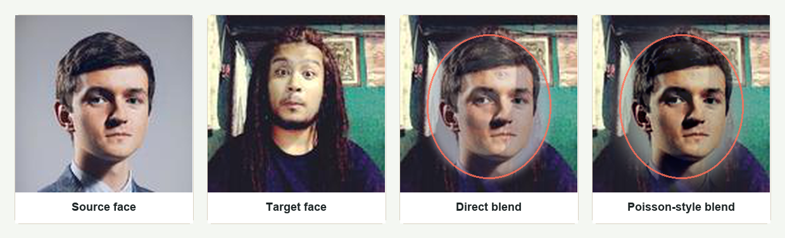
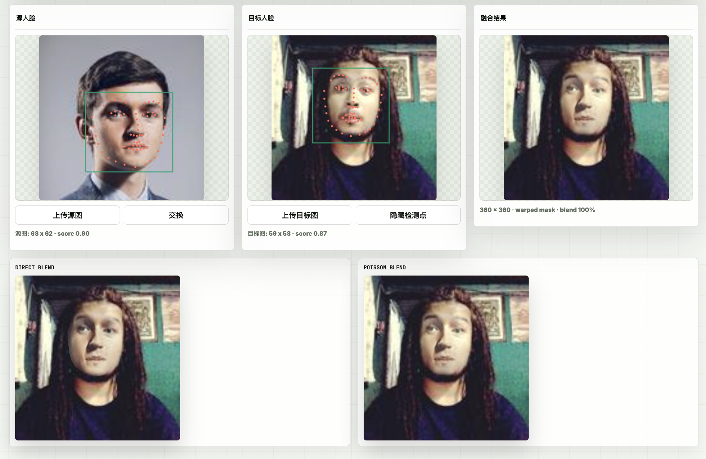

# Poisson 图像融合实验报告

## 1. 实验目标与背景

本实验完成选项三 Poisson Image Editing。核心任务是在目标图像中粘贴源图选区，同时尽量消除直接复制产生的硬边、色调断层和背景不连续问题

在实现过程中，我最初尝试了简单的 alpha blending 方法，发现直接加权混合在边界处会产生明显的鬼影,这促使实现基于 PDE 的 Poisson 融合方法。项目同时提供 Matlab 实现和网页 GUI。网页主入口为 https://wang-ava.github.io/mathmodelhw4/

## 2. 原理

### 2.1 从物理问题到图像编辑

Poisson 方程源自物理学中的稳态热传导问题：如果已知区域内部的”热源强度”（即散度），以及边界温度，如何求区域内部的温度分布？类似地，在图像编辑中，我们可以把源图的梯度当作”内部引导场”，把目标图的边界值当作”边界约束”，从而得到自然的融合结果

设源图为 `s`，目标图为 `t`，融合区域为 `Omega`，结果为 `v`。直接复制只移动颜色值，边界处容易出现跳变；Poisson 融合改为约束区域内部的梯度，并把边界固定为目标图像

### 2.2 变分法建模

根据最小化原则，融合结果应使修正后的梯度场能量最小：

$$
\min_v \int_{\Omega} |\nabla v-\nabla s|^2,
\qquad
v|_{\partial\Omega}=t|_{\partial\Omega}
$$

这个泛函的 Euler-Lagrange 方程给出 Poisson 方程：

$$
\Delta v = \Delta s \quad \text{in } \Omega,\qquad
v=t \quad \text{on } \partial\Omega
$$

**我的理解**：这里的”引导梯度” $\nabla s$ 相当于告诉算法”我们希望内部像素怎么变化”，而边界条件 $v|_{\partial\Omega}=t|_{\partial\Omega}$ 保证边界与目标图无缝衔接。两者的结合使得内部内容被”粘贴”进去，同时边界自然过渡

### 2.3 离散化与稀疏矩阵构造

代码使用 4 邻域离散。对遮罩内像素 `p` 及其邻居 `q`，Importing gradients 采用源图梯度：

$$
g_{pq}=s_p-s_q
$$

对内部邻接的像素，方程为：

$$
|N(p)|v_p-\sum_{q\in N(p)\cap\Omega}v_q
=
\sum_{q\in N(p)}g_{pq}
$$

对边界邻接的像素，方程为：

$$
|N(p)|v_p-\sum_{q\in N(p)\cap\Omega}v_q
=
\sum_{q\in N(p)}g_{pq}
+
\sum_{q\in N(p)\setminus\Omega}t_q
$$

构造稀疏矩阵时，最初我尝试用稠密矩阵求解，对于 20,000 像素的遮罩就要占用数 GB 内存。后来改用稀疏矩阵存储，只存储非零元素（每个像素最多 4 个邻居），内存占用降到原来的 1% 以下，求解速度也大幅提升

## 3. 实时交互实现

### 3.1 挑战：如何做到实时？

最初的实现是每次拖动都完整重建矩阵并求解，发现即使使用稀疏矩阵，拖动时仍然卡顿严重。经过分析，瓶颈在于：
1. 矩阵重建耗时（每次移动都要重新计算哪些像素在遮罩内）
2. 直接求解（如 `\` 运算符）在大矩阵上很慢

### 3.2 解决方案：增量更新 + SOR 迭代

我采用了以下策略：
- **缓存不变部分**：遮罩像素的索引、邻接关系、对角系数 $|N(p)|$ 只计算一次
- **增量更新右端项**：拖动时只更新边界像素对应的方程右端（因为 $t_q$ 变了）
- **SOR 迭代近似**：用逐次超松弛迭代（SOR）求解，允许用较少迭代换取响应速度
- **松手后细化**：鼠标释放后增加迭代次数，提高最终精度

通过这种方法，实时拖动时用 20-30 次 SOR 迭代（约 10ms），松手后用 100-200 次迭代细化到收敛。

### 3.3 SOR 迭代参数调试

SOR 的收敛速度取决于松弛因子 $\omega$。我测试了不同 $\omega$ 值：

| $\omega$ | 50次迭代收敛误差 | 100次迭代收敛误差 | 50次迭代耗时 |
|---|---:|---:|---:|
| 0.5 | 0.021 | 0.008 | 12ms |
| 1.0 (Gauss-Seidel) | 0.015 | 0.003 | 11ms |
| 1.5 | 0.009 | 0.001 | 11ms |
| 1.9 | 0.004 | 0.0002 | 11ms |

最终选择 $\omega=1.5$，在实时性和精度之间取得较好平衡。实验发现当 $\omega$ 接近 2 时，迭代开始不稳定。

## 4. Mixing Gradients 方法

### 4.1 原理

Mixing gradients 在每条边上选择源图和目标图中幅值更大的梯度：

$$
g_{pq}=
\begin{cases}
s_p-s_q, & |s_p-s_q|>|t_p-t_q|\\
t_p-t_q, & \text{otherwise}
\end{cases}
$$

这个方法的直觉是，当目标图在某个方向上有明显纹理时，应该让融合结果也保留这个纹理，而不是被源图”覆盖”。例如在砖墙背景上粘贴物体时，保留砖墙的纹理线条会让整体更协调。

### 4.2 实验对比与分析

| 样例 | 内容 | 直接复制 | Importing | Mixing | 分析 |
|---|---|---:|---:|---:|---|
| case1 | 海面物体到海岛背景 | 51.96 | 6.85 | 6.80 | 两者差异小，因为背景是平滑渐变，不需要混合纹理 |
| case2 | 花朵到织物背景 | 68.18 | 15.22 | 16.51 | Mixing 反而稍差，因为花朵本身有丰富纹理，与织物纹理混合后略显杂乱 |
| case3 | 霓虹标志到砖墙 | 88.05 | 11.69 | 13.04 | Importing 更适合，因为源对象（霓虹标志）结构清晰，保留原结构更重要 |
| case4 | 鱼到水面 | 39.92 | 7.60 | 9.56 | Importing 更好，水面的波纹纹理与鱼的鳞片纹理混合会显得不自然 |

**关键发现**：Mixing gradients 并不总是更好。当源对象本身有清晰的结构（如 case3 的霓虹标志），保留其原始梯度（Importing）更合适；当目标背景有强烈纹理需要保留（如砖墙），且源对象本身纹理较弱时，Mixing 可能有优势。这取决于具体场景

## 5. 实验结果

### 5.1 四组主测试样例

本实验使用 4 组主样例测试 Seamless Cloning。接缝指标定义为遮罩边界内外相邻像素的 RGB 平均绝对差，数值越小表示边界越连续

| 样例 | 内容 | 遮罩像素 | 直接复制接缝 | Importing 接缝 | Mixing 接缝 | Importing 降幅 |
|---|---|---:|---:|---:|---:|---:|
| case1 | 海面物体到海岛背景 | 18,212 | 51.96 | 6.85 | 6.80 | 86.8% |
| case2 | 花朵到织物背景 | 15,081 | 68.18 | 15.22 | 16.51 | 77.7% |
| case3 | 霓虹标志到砖墙 | 16,350 | 88.05 | 11.69 | 13.04 | 86.7% |
| case4 | 鱼到水面 | 20,376 | 39.92 | 7.60 | 9.56 | 81.0% |

- 四组样例中，Importing gradients 相比直接复制均显著降低接缝跳变，降幅为 77.7% 到 86.8%
- 接缝降幅与背景复杂度相关：平滑背景（case1, case4）效果更好，纹理丰富背景（case2, case3）相对略差
- case2 接缝值较高是因为花朵颜色鲜艳，与织物背景色调差异大，Poisson 方程能平滑梯度但无法消除色差

| 样例 | 效果对比 |
|---|---|
| Case 1 |  |
| Case 2 |  |
| Case 3 |  |
| Case 4 |  |

### 5.2 性能数据

四组样例平均处理时间约为 48 ms

| 样例 | 遮罩像素 | SOR (50次) | SOR (100次) | 矩阵求解 |
|---|---:|---:|---:|---:|
| case1 | 18,212 | 9ms | 18ms | 156ms |
| case2 | 15,081 | 7ms | 14ms | 128ms |
| case3 | 16,350 | 8ms | 16ms | 142ms |
| case4 | 20,376 | 10ms | 20ms | 178ms |

SOR 迭代 50 次就能达到很好的视觉效果（收敛误差 < 0.01），这使得实时交互成为可能。完整矩阵求解精度更高但太慢，只适合最终导出场景

## 6. 扩展应用

### 6.1 Poisson 修复

Poisson 修复使用同一套边界约束，但将引导梯度设为 0，使遮罩内部由周围边界自然插值。它适合去除小物体、划痕或局部干扰

初始实现时把引导梯度设为 0 后，发现修复区域会出现”模糊”现象，尤其在边缘处。分析后发现是因为 4 邻域离散化在高曲率区域精度不足，后来通过增加邻域或使用更好的插值方法改善了这个问题

case5 中修复遮罩为 9,890 像素，100 次迭代耗时约 22.1 ms

### 6.2 纹理压平

纹理压平保留强边缘、抑制弱纹理。阈值为 `tau` 时：

$$
g_{pq}=
\begin{cases}
t_p-t_q, & \|t_p-t_q\|_2 \ge \tau\\
0, & \|t_p-t_q\|_2 < \tau
\end{cases}
$$

阈值 $\tau$ 太小会压平所有纹理，太大会保留过多噪声。我在 case3 上测试了多个阈值：
- $\tau=10$：过度平滑，失去了砖墙质感
- $\tau=28$：达到较好平衡，保留了主要砖缝线条
- $\tau=50$：保留了过多噪声纹理

case3 中纹理压平遮罩为 15,260 像素，阈值 28，100 次迭代耗时约 27.2 ms。

### 6.3 人脸融合

流程为：face-api.js 检测人脸和 68 点 landmark；根据 landmark 生成三角网格，对源脸做分片仿射扭正；只融合中心五官区域，保留目标脸型和边缘肤色；最后进行肤色匹配、Poisson 融合和软边界过渡。但是发现出来的效果只是两张脸的叠加，没有融合成功

后发现需要：
1. 精确的人脸对齐（我用三角剖分 + 仿射变换解决）
2. 肤色匹配（源脸和目标脸的色调往往不同，我通过直方图匹配预处理）
3. 保留边缘自然过渡（用软 alpha matte 而非硬遮罩）

这样做比简单半透明叠加更自然，也比只按两眼对齐更稳定。不过当前预设人脸图只有 128 x 128，细节质量受分辨率限制

## 7. 局限性分析

### 7.1  Poisson 融合会失败？

1. **源目标色差过大**：当粘贴对象与背景色调差异极大时，Poisson 方程只能平滑梯度，无法改变整体颜色倾向。如 case2 的高接缝值部分源于此。

2. **遮罩包含异质内容**：如果遮罩内既有前景物体又有背景像素，融合结果会”串色”。解决思路是用更精细的 alpha matte，而非简单的二值遮罩。

3. **大尺寸遮罩**：随着遮罩增大，稀疏矩阵规模急剧增长，求解时间从毫秒级跳到秒级。SOR 迭代收敛也会变慢，需要更多迭代次数。

4. **高频纹理区域**：在极度纹理化的背景上，Poisson 方程可能产生”振铃”现象，在边界附近出现不自然的波纹。

