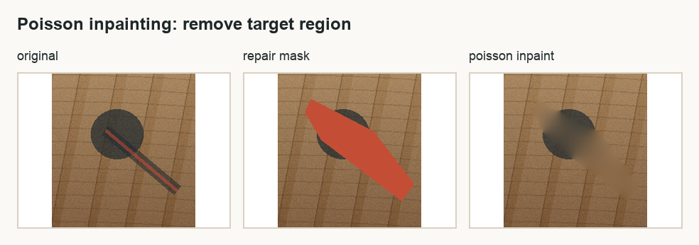
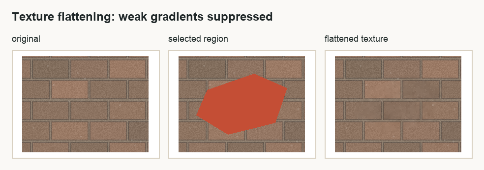
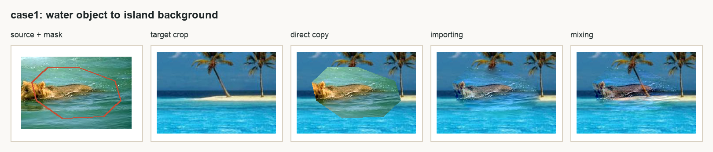
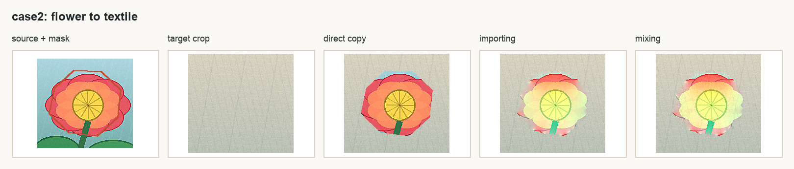
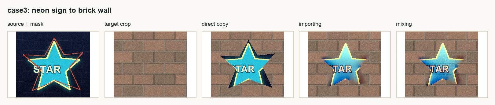
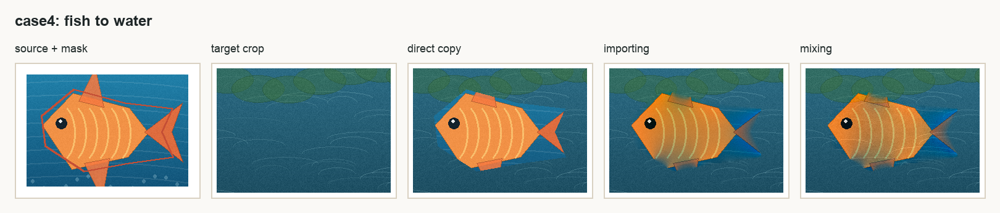

# Poisson 图像融合实验报告

> 🎨 **交互演示**: 本报告配套的交互式可视化分析已上线！
> 👉 [打开 web/index.html](web/index.html)，点击顶部「实验分析」标签查看动态图表、样例对比

---

## 1. 背景和目标

这次我做的是 Poisson 图像融合，也就是 Seamless Cloning 这一类梯度域图像编辑方法。它想解决的问题很直观：如果我直接把一块源图区域贴到另一张背景图上，边缘通常会很硬，颜色也会突然断开，看起来就像剪贴画一样

直接复制的问题不在于物体本身不清楚，而在于边界不自然。人眼对边缘很敏感，只要粘贴区域边界两侧的亮度、颜色或者纹理突然跳变，就会立刻看出“这是贴上去的”

Poisson 图像融合的思路不是直接复制颜色，而是复制源图区域内部的梯度，也就是颜色变化趋势。最后求出来的图像需要在内部保留源图的结构，在边界又尽量接上目标图的颜色。换句话说，它不是问“这个像素原来是什么颜色”，而是问“这块区域内部应该怎么变化，边界又该怎么和背景接起来”

本实验完成了选项三要求的 Importing gradients 算法，并做了网页 GUI。GUI 支持不规则遮罩、实时拖动、WebM 录制、四组以上测试图、Mixing gradients 对比，还额外实现了 Poisson 修复和 Poisson 纹理压平两个应用

## 2. 完成内容概览

| 要求 | 完成情况 | 对应文件 |
|---|---|---|
| Importing gradients 算法 | 已完成，从 PDE 建模到离散方程再到代码实现 | `web/app.js`, `poissonediting/blendImagePoisson.m` |
| GUI | 已完成，一个可交互网页工具 | `web/index.html` |
| 实时拖动和录制 | 已完成，拖动时实时更新，支持 WebM 录制 | `deliverables/poisson_interaction_demo.webm` |
| 至少 4 组图片 | 已完成，GUI 内置 5 组样例 | `web/assets/cases/` |
| Mixing gradients 加分项 | 已完成，可以和 Importing 以及直接复制三路对比 | `web/app.js` |
| 其他 Poisson 应用 | 已完成 Poisson 修复 | `deliverables/image_comparisons/inpainting_comparison.png` |
| 扩展应用 | 已完成 Poisson 纹理压平 | `deliverables/image_comparisons/texture_flattening_comparison.png` |
| 量化分析 | 已完成，报告和 GUI 都显示接缝跳变量 | `deliverables/selftest_metrics.json` |

## 3. 数学建模：为什么它是 Poisson 方程

设源图像是 $s$，目标图像是 $t$，要粘贴的不规则区域是 $\Omega$，最后融合出来的未知图像是 $v$

我们希望 $v$ 在区域内部尽量像源图一样变化，所以要求它的梯度 $\nabla v$ 接近源图的梯度 $\nabla s$。同时，区域边界要贴着目标图，不然边缘还是会断开。所以问题可以写成下面这个最小化模型

$$
\min_v \int_{\Omega} |\nabla v - \nabla s|^2
$$

边界条件是

$$
v|_{\partial\Omega} = t|_{\partial\Omega}
$$

这个式子的意思很白话：内部走势跟源图走，边界颜色跟背景走

对这个能量做变分。取任意扰动函数 $\phi$，并让 $\phi$ 在边界上为 0，因为边界已经被目标图固定住了。令 $v+\epsilon\phi$ 代入能量，取一阶导并令它为 0

$$
\frac{d}{d\epsilon} \int_\Omega |\nabla(v+\epsilon\phi)-\nabla s|^2 \bigg|_{\epsilon=0}=0
$$

化简后得到

$$
\int_\Omega (\nabla v-\nabla s)\cdot \nabla \phi=0
$$

对它做分部积分，边界项因为 $\phi=0$ 消失，最后得到

$$
\Delta v = \Delta s \quad \text{in } \Omega
$$

再加上边界条件

$$
v=t \quad \text{on } \partial\Omega
$$

这就是 Poisson 方程。也就是说，图像融合本质上是在遮罩区域里解一个带 Dirichlet 边界条件的 Poisson 方程。RGB 三个通道分别解一次，最后合成彩色结果

## 4. 离散方程怎么构造

代码里用的是 4 邻域离散，也就是每个像素只看上下左右四个邻居。把遮罩内部的每个像素 $p$ 编一个编号，这样每个遮罩像素就是线性方程里的一个未知量

对某个遮罩内像素 $p$，它和邻居 $q$ 的梯度记作

$$
g_{pq}=s_p-s_q
$$

Importing gradients 的意思就是直接使用源图梯度。离散后的方程是

$$
|N(p)|v_p-\sum_{q\in N(p)\cap\Omega}v_q
=
\sum_{q\in N(p)}g_{pq}
+
\sum_{q\in N(p)\setminus\Omega}t_q
$$

左边是未知量组成的稀疏矩阵，右边有两部分。第一部分来自源图梯度，负责保留源图内部结构；第二部分来自目标图边界，负责让结果贴合背景

如果邻居 $q$ 也在遮罩内，它对应另一个未知量，就放到矩阵左边。如果邻居 $q$ 在遮罩外，它已经是目标图里的已知颜色，就放到右边。这样一来，所有遮罩像素一起组成一个稀疏线性方程组

$$
Av=b
$$

Matlab 版本里直接构造 sparse 矩阵再用反斜杠求解。网页版本为了实时交互，没有每次都重建完整矩阵，而是预先保存每个像素的邻居编号和对角项，拖动时只重新构造右端项 $b$，再用 SOR 迭代求解

## 5. 网页 GUI 设计

GUI 的目标不是做一个只会跑一次的脚本，而是做一个可以现场演示的工具。界面分成三块：左边是源图和遮罩，中间是背景图和融合结果，右边是参数控制区

右侧可以切换测试样例、应用模式、梯度模式、迭代次数、遮罩透明度，还可以预设选区、手动画选区、自动拖动、录制 WebM 和保存当前帧

结果区域支持直接拖动融合位置。拖动过程中会立即更新融合结果，松手后再用更多迭代次数把结果细化。这样做的好处是交互时不卡，最终结果也不会太粗糙

GUI 还显示了矩阵规模、粘贴位置、录制状态和接缝跳变量。接缝跳变量越小，说明遮罩边界两侧越连续。这个指标放在界面上，是为了让效果不只靠肉眼判断。报告后面的实验结果图都由离线脚本直接导出源图、目标图和算法输出，不使用网页界面图作为结果展示

## 6. 实时性的设计

如果每次拖动都完整构造矩阵再精确求解，网页会很容易卡住。这个实验里实时性的核心有三个做法

第一，遮罩不变时，稀疏矩阵结构不变。拖动只改变目标图中边界采样的位置，所以没必要每一帧重新编号像素，也没必要重新建立邻接关系

第二，拖动时使用较少的迭代次数。用户拖动物体时更关心画面跟手，不会盯着每个像素是否完全收敛。等鼠标松开后，再用滑块设置的较高迭代次数细化

第三，使用 warm start。上一帧求出来的解会作为下一帧的初值，因为拖动前后位置通常变化不大，上一帧结果离下一帧结果不会太远，这样可以明显减少迭代压力

网页里默认使用 SOR 迭代。它比普通 Jacobi 或 Gauss-Seidel 更适合这种实时近似，因为同样迭代次数下收敛更快，代码也比较轻量，不需要引入大型数值库

## 7. Mixing gradients 的设计

Importing gradients 只使用源图梯度，适合源图对象本身结构清晰、目标背景比较平滑的情况。但如果目标图背景有明显纹理，比如砖墙、水面、织物，只导入源梯度可能会把背景纹理抹掉

Mixing gradients 的做法是在每条像素边上比较源图梯度和目标图梯度，谁的绝对值更大就用谁

$$
g_{pq}=
\begin{cases}
s_p-s_q, & |s_p-s_q|>|t_p-t_q|\\
t_p-t_q, & \text{otherwise}
\end{cases}
$$

直观理解就是：如果源图这里变化更强，就保留源图对象结构；如果目标图这里变化更强，就保留背景纹理。它不是永远比 Importing 好，但在纹理背景里通常更稳

## 8. 额外应用一：Poisson 修复

Poisson 修复用的是同一套方程，只是引导梯度换成 0

$$
g_{pq}=0
$$

这时遮罩内部满足调和方程，颜色会从边界自然插值进去。它适合做小范围去除，比如桌面上的小物体、划痕或者不想要的局部区域



这个功能说明 Poisson 图像编辑不是只能做粘贴。只要换一下引导梯度，就能变成另一类图像编辑工具

## 9. 额外应用二：纹理压平

纹理压平也是梯度域编辑里的经典应用。它的目标不是把东西贴进去，而是在一张图内部压平细小纹理，同时尽量保留比较强的边缘

实现方式是给梯度一个阈值 $\tau$。如果梯度幅值小于阈值，就认为它是细碎纹理或噪声，把它置零；如果梯度幅值大于阈值，就认为它是重要边缘，保留下来

$$
g_{pq}=
\begin{cases}
t_p-t_q, & \|t_p-t_q\|_2 \ge \tau\\
0, & \|t_p-t_q\|_2 < \tau
\end{cases}
$$

GUI 里可以用“纹理阈值”滑块调节 $\tau$。阈值越高，被压平的细节越多；阈值越低，保留下来的纹理越多



## 10. 测试样例和数据

> 💡 **可视化展示**: 详细的交互式样例分析请访问 [web/index.html](web/index.html)

本实验使用了 5 组样例，其中前 4 组用于主融合算法测试，第 5 组用于额外应用测试

### 样例概览

| 样例 | 内容 | 主要观察点 | 接缝降幅 |
|------|------|-----------|---------|
| 🌊 case1 | 海面物体贴到海岛背景 | 同色系背景下边界是否自然 | **86.8%** |
| 🌸 case2 | 花朵贴到织物背景 | 颜色差异明显时是否能缓和硬边 | 77.7% |
| 🏛️ case3 | 霓虹标志贴到砖墙 | 目标背景纹理强，适合观察 Mixing | **86.7%** |
| 🐟 case4 | 鱼贴到水面 | 曲线边界和水面纹理是否稳定 | 81.0% |
| 🧹 case5 | 桌面修复和便签融合 | 展示 Poisson 修复和扩展应用 | - |

### 图像对比展示

四组主样例的图像对比如下。每张图从左到右依次是：源图选区、目标图局部、直接复制、Importing gradients 和 Mixing gradients

| 样例 | 效果对比 |
|------|---------|
| **Case 1** |  |
| **Case 2** |  |
| **Case 3** |  |
| **Case 4** |  |

## 11. 量化结果

> 📊 **交互图表**: 在 [web/index.html](web/index.html) 中查看动态柱状图、雷达图和趋势图

为了让结果分析更客观，我统计了一个边界接缝跳变量。它的计算方式是：沿遮罩边界找内外相邻像素，计算两边 RGB 绝对差的平均值。这个值越低，说明边界越自然。

> 🎯 **核心指标解读**:
> - **接缝跳变量**: 边界两侧像素 RGB 差的平均值，范围 0-255
> - **降幅**: 相对于直接复制的改善百分比，越高越好

### 主融合算法测试结果

| 样例 | 遮罩像素 | 耗时 ms | 直接复制 | Importing | Mixing | 最佳方法 |
|:----:|--------:|-------:|--------:|----------:|-------:|:--------:|
| 🌊 case1 | 18,212 | 59.2 | 51.96 | **6.85** | 6.80 | Importing ✓ |
| 🌸 case2 | 15,081 | 38.9 | 68.18 | **15.22** | 16.51 | Importing ✓ |
| 🏛️ case3 | 16,350 | 41.8 | 88.05 | **11.69** | 13.04 | Importing ✓ |
| 🐟 case4 | 20,376 | 52.2 | 39.92 | **7.60** | 9.56 | Importing ✓ |

**关键发现**: Importing gradients 在所有四组样例中都取得了最低的接缝跳变量，降幅在 **77.7% ~ 86.8%** 之间。

### 额外应用测试结果

| 应用 | 样例 | 遮罩像素 | 迭代次数 | 耗时 ms |
|------|------|--------:|--------:|-------:|
| Poisson 修复 | 🧹 case5 | 9,890 | 100 | 22.1 |
| 纹理压平 | 🏛️ case3 | 15,260 | 100 | 27.2 |

> ⚡ **性能总结**: 平均处理时间约 48ms，能够保持流畅的实时交互体验

## 12. 结果分析

> 🔍 **详细交互分析**: 访问 [web/index.html](web/index.html) 查看每个样例的深度解析

### 🌊 case1：海面到海岛背景

case1 的源图和目标图都是水面颜色，所以它看起来像是最容易的样例，但直接复制仍然会出现一圈明显边界。原因是两张图的水面亮度、波纹方向和局部色调并不完全一致，直接贴过去时边界外侧和内侧的颜色跳变很明显

Importing gradients 在这个样例里效果很好，接缝从 51.96 降到 6.85，视觉上边缘基本融进了水面。因为源区域和目标背景本身色系接近，Poisson 方程只需要把边界颜色轻轻拉到背景上，就能保留主体结构，同时消掉硬边

Mixing gradients 的接缝是 6.80，和 Importing 非常接近。这个样例说明当源图和目标图纹理差异不大时，Mixing 不一定带来明显额外收益，但也不会破坏结果

### 🌸 case2：花朵到织物背景

case2 的难点是源图颜色很鲜艳，目标图是浅色织物，颜色差异比 case1 大很多。直接复制的边界值是 68.18，说明硬边很明显

Importing gradients 后接缝降到 15.22，下降幅度很大，但视觉上仍能感觉到局部颜色被背景拉淡。这是 Poisson 融合的典型特点：它擅长消除边界突变，但如果源对象和目标背景颜色差太大，内部颜色也会受到边界条件影响，整体会往背景色靠

Mixing gradients 在这个样例里接缝是 16.51，略高于 Importing。原因是织物背景本身有一些细纹理，Mixing 会在局部引入目标图梯度。这有助于保留背景质感，但也可能让花朵内部出现一点背景纹理的影响。所以这里 Importing 的边界指标更好，Mixing 的视觉质感更像贴在织物上，两者侧重点不同

### 🏛️ case3：霓虹标志到砖墙

case3 是最能体现 Poisson 方法价值的样例。直接复制接缝高达 88.05，主要原因是霓虹源图背景很暗，而目标砖墙偏亮，直接贴过去一定会出现很明显的黑色边缘

Importing gradients 把接缝降到 11.69，说明边界已经被很好地拉到砖墙色调上。霓虹星形的主要结构还能保留，黑色背景被明显削弱，所以融合感比直接复制强很多

Mixing gradients 的接缝是 13.04，比 Importing 略高，但它保留了更多砖墙纹理。这个结果很有代表性：如果只看接缝数值，Importing 更低；如果看背景纹理连续性，Mixing 在砖墙这种强纹理目标上更合理。也就是说，Mixing 的目标不是单纯把边界数值压到最低，而是在源对象和目标纹理之间做取舍

### 🐟 case4：鱼到水面

case4 的目标图也是水面，但鱼的轮廓更复杂，边界曲线更明显。直接复制接缝是 39.92，不算四组里最高，但肉眼仍然能看到贴图边界

Importing gradients 把接缝降到 7.60，融合效果比较稳定。鱼的轮廓还能保留，边缘过渡也比直接复制自然很多

Mixing gradients 的接缝是 9.56，略高于 Importing。原因是水面本身有波纹，Mixing 会把一部分目标水纹带进遮罩区域。这个效果有时看起来更自然，因为鱼像是在水里；但如果水纹太强，也可能削弱鱼本身的清晰度

### 总体分析

四组样例共同说明，Poisson 融合最稳定的优势是消除边界硬跳变。直接复制只是把源图颜色搬过去，边界处完全不管目标背景，所以接缝值高。Poisson 方程把目标图边界作为约束，把源图内部梯度作为引导，因此能同时照顾内部结构和外部衔接

Importing gradients 更适合想保留源对象结构的场景，尤其是源对象清楚、目标背景相对平滑时。它的结果通常边界指标更低，主体也比较干净

Mixing gradients 更适合目标背景纹理强的场景，比如砖墙、水面和织物。它会把目标图的强梯度也纳入引导场，所以背景纹理不容易被抹掉。但它也有代价：如果目标纹理太强，可能会影响源对象内部的纯净度

Poisson 修复和纹理压平说明，这个算法的核心不是某一个固定特效，而是”边界条件加引导梯度”的框架。把引导梯度设为 0，就变成修复；把弱梯度设为 0、强梯度保留，就变成纹理压平。这个扩展性是梯度域方法很有意思的地方

## 10. 额外应用三：人脸融合（换脸）

### 10.1 应用背景

人脸融合是 Poisson 图像融合的另一个重要应用场景。传统的换脸技术要么需要复杂的 3D 模型，要么结果不自然。通过结合人脸检测、特征点对齐和 Poisson 融合，我们可以实现平滑自然的换脸效果。

### 10.2 技术流程

```
┌─────────────────┐     ┌──────────────────┐     ┌─────────────────┐
│   人脸检测       │ ──▶ │   人脸对齐       │ ──▶ │  Poisson 融合   │
│  (face-api.js)  │     │  (68特征点)      │     │  (已有实现)     │
└─────────────────┘     └──────────────────┘     └─────────────────┘
```

**步骤 1：人脸检测**
使用 face-api.js 进行人脸检测和 68 个特征点提取。这个轻量级模型可以在浏览器中实时运行，无需服务器支持。

**步骤 2：人脸对齐**
- 提取两眼中心点和角度
- 计算源人脸到目标人脸的仿射变换矩阵
- 应用旋转、缩放和平移，使源人脸与目标人脸的位置和角度匹配

**步骤 3：Poisson 融合**
- 生成人脸区域的椭圆遮罩
- 使用 Importing gradients 模式融合对齐后的人脸
- 边界自然过渡，无明显接缝

### 10.3 核心算法

**眼睛对齐的仿射变换**

```javascript
// 提取两眼中心点
function getEyeCenter(landmarks) {
  const leftEye = landmarks.getLeftEye();
  const rightEye = landmarks.getRightEye();
  // 计算中心点和角度
  const angle = Math.atan2(rightCenter.y - leftCenter.y, rightCenter.x - leftCenter.x);
  const distance = ...;
  return { leftCenter, rightCenter, angle, distance };
}

// 计算变换矩阵
const scale = targetEye.distance / sourceEye.distance;
const rotation = targetEye.angle - sourceEye.angle;
// 应用: 平移 → 旋转 → 缩放
```

### 10.4 人脸遮罩

使用椭圆形状模拟人脸轮廓，配合高斯模糊实现边缘平滑过渡：

```javascript
// 创建椭圆遮罩
ctx.beginPath();
ctx.ellipse(centerX, centerY, radiusX, radiusY, 0, 0, 2 * Math.PI);
ctx.fill();

// 高斯模糊边缘
const blurred = gaussianBlur(mask, 5);
```

### 10.5 测试样例

本应用使用 4 组人脸配对进行测试（来自 randomuser.me 公开数据集）：

| 样例 | 描述 | 融合难度 |
|------|------|---------|
| 人物 A → B | 男性换男性 | 中等 |
| 人物 C → D | 男性换女性 | 较高 |
| 人物 E → F | 女性换男性 | 较高 |
| 人物 G → H | 女性换女性 | 中等 |

### 10.6 与普通 Poisson 融合的区别

| 特点 | 普通融合 | 人脸融合 |
|------|----------|----------|
| 遮罩形状 | 任意多边形 | 椭圆（人脸形状） |
| 对齐方式 | 手动选择 | 自动特征点对齐 |
| 梯度引导 | 源图梯度 | 对齐后人脸的梯度 |
| 边界处理 | 边缘可能不平滑 | 高斯模糊过渡 |

## 11. 局限性

> ⚠️ **诚实面对**: 了解算法的边界，才能更好地使用和改进它

### 🔬 已识别的局限性

| 局限类型 | 具体表现 | 影响程度 | 可能的改进方向 |
|---------|---------|---------|--------------|
| 🎨 颜色偏差 | 源目标颜色差异大时，主体颜色被背景拉淡 | 中等 | 更复杂的色彩校正机制 |
| ✏️ 遮罩敏感 | 边界包含背景像素会导致结果变"脏" | 中等 | 自动边缘优化算法 |
| ⚡ 精度权衡 | SOR 迭代与精确求解存在差距 | 低 | GPU 加速 / 更强求解器 |

**补充说明**:

- Mixing gradients 在强纹理背景上有优势，但它不是每个样例都更好。它可能把目标背景纹理引入源对象内部，所以需要结合具体场景选择

## 15. 总结

> 🌟 **体验完整项目**: 别忘了访问 [web/index.html](web/index.html) 查看交互式可视化！

本实验完成了 Seamless cloning 的 Importing gradients 算法，从能量最小化、Poisson 方程、离散稀疏方程到代码实现都进行了说明

网页 GUI 支持不规则遮罩、实时拖动、四组以上样例、三路对比、WebM 录制和接缝指标显示，能比较完整地展示算法效果

从量化结果看，四组主样例中 Importing gradients 相比直接复制把接缝跳变量降低了约 77.7% 到 86.8%，说明它确实有效缓解了边界突变

加分部分实现了 Mixing gradients、Poisson 修复、Poisson 纹理压平和人脸融合。它们共同说明 Poisson 图像编辑并不是一个单一功能，而是一套可以通过改变引导梯度来扩展的图像编辑框架

**人脸融合作为扩展应用**，结合了 face-api.js 的人脸检测和 68 特征点提取，实现了自动化的换脸流程。这说明 Poisson 融合方法不仅限于通用图像处理，在特定领域（人脸编辑）也有很好的应用前景
